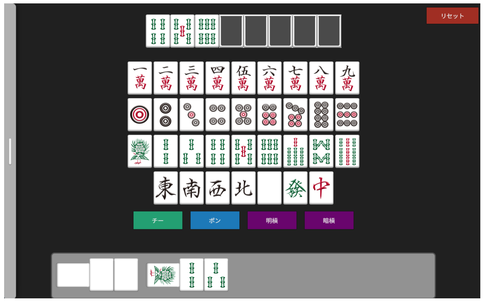
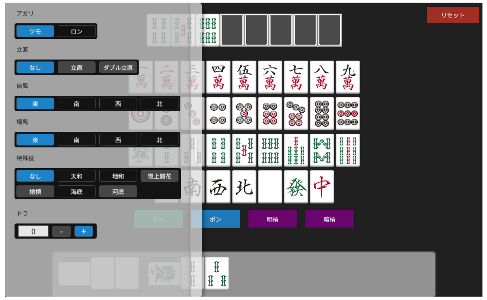
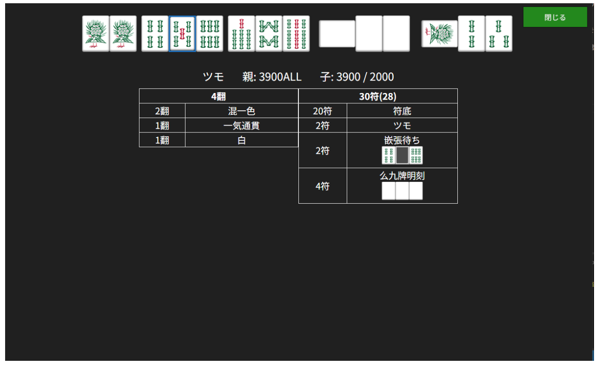

# 麻雀点数計算・役判定ツール

## 概要

麻雀の手牌から、役・符・翻数・点数などを計算できるWebアプリケーションです。

フロントエンドにはReact、
麻雀の計算処理にはTypescriptで実装した独自の麻雀エンジンを使用しています。

麻雀の点数計算だけでなく、役判定、待ち判定、シャンテン数の計算など
麻雀の手牌解析に必要な機能を段階的に実装しています。

## デモ

[ここをクリックでデモが起動します](https://chinokafu.jp/product/mahjongScoreCalc/index)

### 手牌入力



### 詳細設定



### 計算結果



## 主な機能

- 手牌入力
- 鳴き牌の入力
- 待ち判定
- 役判定
- 符計算
- 翻数計算
- 点数計算
- シャンテン数計算
- 立直などの詳細設定の条件に応じた入力制御

## 技術構成

### フロントエンド

- React
- TypeScript
- CSS

### バックエンド

- Node.js
- TypeScript

### 麻雀エンジン

- TypeScript

### テスト

- Jest
- Qlty

## プロジェクト構成

### フロントエンド
```
frontend/
│  App.css
│  App.tsx
│  global.d.ts
│  layout.tsx
│  page.tsx
│
├─components
│      Modal.tsx
│      NakiButtons.tsx
│      NakiView.tsx
│      NotenModal.tsx
│      NoYakuModal.tsx
│      ResultTable.tsx
│      ResultView.tsx
│      SettingsRadioBtn.tsx
│      SettingsStepper.tsx
│      SettingsView.tsx
│      TehaiInputView.tsx
│      TehaiView.tsx
│
└─modules
        AgariUtils.ts
        CommonUtils.ts
        HandState.ts
        MachiUtils.ts
        MahjongAPIGetter.ts
        MapSettingsToContext.ts
        MeldUtils.ts
        TypeDefs.ts
```
### 麻雀エンジン
```
mahjong_engine/
│
├─modules
│  │  BlockDivider.ts
│  │  BlockHais.ts
│  │  BlockHaisList.ts
│  │  Hai.ts
│  │  Hais.ts
│  │  IMentsu.ts
│  │  index.ts
│  │  MachiCalculator.ts
│  │  MahjongConsts.ts
│  │  Meld.ts
│  │  Melds.ts
│  │  MentsuAnalyzer.ts
│  │  PlayerContext.ts
│  │  PlayerHand.ts
│  │  ShantenCalculator.ts
│  │  tileDefs.ts
│  │
│  ├─tensuu
│  │      FuCalculator.ts
│  │      FuDetail.ts
│  │      ScoreResolver.ts
│  │      ScoreResult.ts
│  │      TensuuCalculator.ts
│  │      TensuuResult.ts
│  │
│  └─yaku
│      │  index.ts
│      │  NormalYakuChecker.ts
│      │  YakuChecker.ts
│      │  YakuCheckerBase.ts
│      │  YakuContext.ts
│      │  YakumanChecker.ts
│      │
│      ├─normal
│      │      ChinitsuChecker.ts
│      │      ChitoitsuChecker.ts
│      │      DaburiiChecker.ts
│      │      DoukouChecker.ts
│      │      HonchanChecker.ts
│      │      HonitsuChecker.ts
│      │      HonrotoChecker.ts
│      │      IipekoChecker.ts
│      │      IppatsuChecker.ts
│      │      IttsuuChecker.ts
│      │      JunchanChecker.ts
│      │      KazehaiChecker.ts
│      │      MenzenTsumoChecker.ts
│      │      PinfuChecker.ts
│      │      RenpuuhaiChecker.ts
│      │      RiichiChecker.ts
│      │      RyanpekoChecker.ts
│      │      SanankoChecker.ts
│      │      SankantsuChecker.ts
│      │      SanshokuChecker.ts
│      │      ShosangenChecker.ts
│      │      TanyaoChecker.ts
│      │      ToitoiChecker.ts
│      │      YakuhaiChecker.ts
│      │
│      └─yakuman
│              ChinrotoChecker.ts
│              Churen9Checker.ts
│              ChurenChecker.ts
│              DaisangenChecker.ts
│              DaisushiChecker.ts
│              ExtendedYakumanChecker.ts
│              Kokushi13Checker.ts
│              KokushiChecker.ts
│              RyuisoChecker.ts
│              ShosushiChecker.ts
│              SuankoChecker.ts
│              SuankoTankiChecker.ts
│              SukantsuChecker.ts
│              TsuisoChecker.ts
│
│
└─tests
│  fu.test.ts
│  hanName.test.ts
│  machi.test.ts
│  machiType.test.ts
│  score.test.ts
│  shanten.test.ts
│  tehaiCaseRunner.ts
│  tensuuFromNum.test.ts
│  testConsts.ts
│  toBlock.test.ts
│  yaku.test.ts
│
├─machi
│  chinitsu.ts
│  chitoitsu.ts
│  kokushi.ts
│  maisuu.ts
│
├─shanten
│  test1.ts
│
├─tensuu
│  fu.ts
│  hanName.ts
│  score.ts
│  tensuuNum.ts
│
└─yaku
   normal.ts
   yakuman.ts
```


## セットアップ

## 使い方

## 設計

## テスト

Jestを使用してユニットテストを実装しています。

特に麻雀の役判定・待ち判定・シャンテン数計算について、
様々な牌姿を用いたテストを作成しています。

### テストカバレッジ

麻雀エンジン側
- Stmts:97.14%
- Branch:93.33%
- Funcs:92.46%
- Lines:97.93%

### 静的解析（Qlty）

麻雀エンジン側
- Maintainability: A
- Coverage: A
- Security: A

フロント側
- Maintainability: A
- Security: A


## 工夫した点

### 麻雀ロジックとUIの分離

麻雀の計算処理をmahjong_engineとして独立させ、
UIから直接計算ロジックを扱わない構成にしました。

### テストによるロジック検証

麻雀の役判定や待ち判定など、組み合わせの多い処理について
ユニットテストを作成しています。

### シャンテン数計算の探索量削減

シャンテン数計算では不要な探索を避けるため、
和了・聴牌状態を先に判定するなどの最適化を行っています。

## 今後の予定

- フロントエンドのテスト追加
- UI/UX改善
- 麻雀ルールへの対応拡張
- パフォーマンス改善
- ドキュメント整備
- 麻雀ゲームの作成

## ライセンス